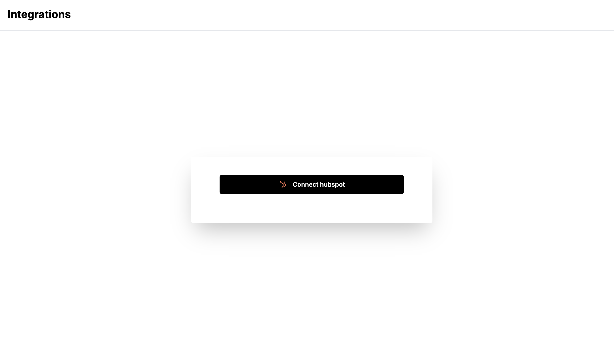

# Integrations PoC


The sample app is a practical demonstration of integrating Nango : 


It contains:
- **A frontend**: lets users connect an integration using the Nango frontend SDK.
- **A backend**: listens to Nango webhooks and consumes the Nango API to read & write data.

  

The sample app uses Hubspot as an example integration.

### Run the sample app


1. ### Create a Hubspot integration
    1.  Create a developer account
        - Go to [Hubspot's developer signup page](https://app.hubspot.com/signup-hubspot/developers) and create an account. 
    2. Create & configure a Hubspot app
        - Start creating a Hubspot app by clicking on the _Create app_ button. 

          In the _Auth_ tab, configure the following Redirect URL: `https://api.nango.dev/oauth/callback`.

          Create the Hubspot app. In the _Auth_ tab, copy/paste the `Client ID` and `Client secret`, you will need to specify it in Nango later on.
    3. Set up the OAuth scopes
        - Still in the _Auth_ tab, add the scopes that are relevant to how you want to consume the Hubspot API. Copy/paste the list of scopes, you will need to specify it in Nango later on.
            - `crm.objects.contacts.read`
            - `crm.objects.contacts.read`
    4. Create a Hubspot test account
        - If you don't have a Hubspot account already, create one to test your integration. 
    5. Next
        - Go back to Nango. In the "Integrations" tab, add `Client ID` and `Client secret` in the Hubspot integration in the `Settings` tab. 
    
2. ### Prepare your env
    - Install: `NodeJS`, `Docker`. Then run:

    ```sh
    git clone https://github.com/bharat2913/Integrations-PoC.git

    cd sample-app

    nvm use
    npm i
    docker-compose up -d
    ```
    - Copy your Nango Secret Key, found in [Environment Settings](http://localhost:3003/dev/environment-settings?source=sample-app).
    - Create a file to store environment variables and fill in the Nango Secret Key:
    ```sh
    cp .env.example .env && cd front-end && cp .env.example .env
    ```
    - Generate encryption key and fill in NANGO_ENCRYPTION_KEY
    ```
    openssl rand -base64 32
    ```
3. ### Transfer Nango webhooks locally
    - This command should be running at all time:

    ```sh
    npm run webhooks-proxy
    ```

    - Copy the URL the command gave you and go to Environment Settings. Set Webhook URL to ${URL}/webhooks-from-nango, e.g: https://tame-socks-warn.loca.lt/webhooks-from-nango.
4. ### Launch
    - Run:
    ```sh
    npm run start
    ```
    - Go to: [http://localhost:3011](http://localhost:3011)
    - Go to: [http://localhost:3003](http://localhost:3003) for Nango's Dashboard

